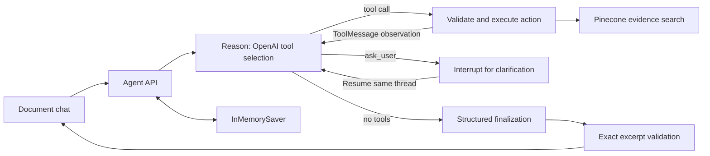

# Document agent — first working increment

The document chat uses an explicit LangGraph ReAct graph in a unified chat workspace, with the calculator available in a separate collapsible section. The original single-question RAG API remains supported. OpenAI chooses document tools, sees their
observations, can refine a search or ask for clarification, then produces an answer
checked against retrieved page excerpts. It does not calculate bills or rank offers.

## Run locally

From the application directory, use an environment with `requirements-rag-dev.txt`
installed (or `requirements-rag.txt` for runtime). The agent adds no new packages.
The existing ignored `.env` supplies OpenAI/Pinecone configuration. The configured
index and active local manifest are reused; startup does not ingest documents.

```sh
python -m uvicorn backend.api.main:app --env-file .env --host 127.0.0.1 --port 8012
```

Open `http://127.0.0.1:8012/` and use **Plan assistant**. Try:

1. “What is the contract term of the 4Change plan?”
2. “And what is its early termination fee?”
3. “What is my exact total bill at 1200 kWh?” (expect a supported limitation).

Answer clarification in the same message box. **New conversation** clears the
thread. Refreshing starts another thread. Conversations expire after 30 idle
minutes and disappear on server restart/reload. Run one worker; checkpoints are
in memory, not in the calculator's SQLite database.

## Architecture



`backend/agent/graph.py` contains the explicit `StateGraph`, `add_messages`,
reason/action routing, `ToolMessage` creation and `interrupt`. `runtime.py` owns
sessions and uses `Command(resume=...)`. `model.py` adapts OpenAI Responses function
calls to LangGraph messages. `knowledge/evidence.py` shares deterministic source
selection and citation validation with the original RAG graph.

Four allowed tools: `list_indexed_documents`, `search_document_evidence`, and
`ask_user`, and `redirect_to_comparison`. Factual document turns require a tool action until retrieval has been attempted; calculation redirects do not retrieve.
Only current-turn evidence can support the final answer. Stable source IDs include
corpus version, document hash and page identity. A corpus change during a pending
clarification requires a new conversation.

## HTTP contracts

- `GET /api/agent/status`: local configuration, dependency availability, indexed
  documents and memory lifecycle; does not probe live provider readiness.
- `POST /api/agent/threads`: returns `thread_id`, an opaque bearer `token`, and
  `expires_in_seconds`. The browser retains the token only in memory.
- `POST /api/agent/threads/{id}/messages`: `{request_id, message, document_id?}`.
- `POST /api/agent/threads/{id}/resume`: `{request_id, message, interrupt_id}`.
- `DELETE /api/agent/threads/{id}`: clear the conversation.

Thread operations require `Authorization: Bearer <token>`. Generate a UUID request
ID for each new operation; retry the identical operation with the same ID after a
network failure. Reusing an ID with different input returns 409. Responses contain
`status`, `thread_id`, `turn_id`, safe `activity` summaries and either answer/citations
or a clarification question/interrupt ID. Statuses are `answered`, `needs_input`,
`insufficient_evidence` and `limit_reached`.

The browser disables concurrent submits; the server also rejects overlapping
thread operations with 409. Expired/unknown/inaccessible threads return 404.
Invalid input returns 422, missing configuration 503, provider failures 502 and
conversation capacity exhaustion 429. Provider failures stop that thread; use New
conversation. API keys, provider errors and internal graph state are never returned.
This local session capability is not production authentication or rate limiting.

## Bounds and current limitations

- Up to six model calls per logical turn: at most five reasoning calls plus finalization.
  One repair finalization is permitted only after fewer than five reasoning calls. At most three
  searches, eight tool calls and 30 graph steps. Clarification resumes retain counters.
- Current and retained message/evidence payloads stop conservatively near a 12k
  input-token ceiling (2k reserved for instructions/tool schemas), rather than
  silently truncating context. Up to 20 turns and 100 retained threads.
- Provider operations use bounded timeouts; model calls have no automatic retry.
  A hard end-to-end cancellation deadline remains deferred.
- Evidence is checked for source/version membership and exact excerpt presence.
  This does not prove semantic entailment. One citation repair is available within the six-call budget. Unknown excerpt IDs reject the whole draft; deliberate abstention and provider errors are not retried.
- No streaming, durable history, multi-worker support, automatic ingestion,
  full history restoration, or full production authentication.
- Only active-manifest documents are searchable. The repository has additional
  PDFs that have not been published to the active corpus; see the implementation plan.

## Verification

```sh
python -m unittest discover -s tests -v
node --test tests/agent-ui.test.cjs tests/zip-ui.test.cjs
node --check frontend/agent.js
```

Offline tests exercise the API with the real graph and scripted model/providers,
including multi-search, follow-ups, interruption/resume, duplicate requests, wrong
session tokens, expiry, changed corpus, invalid citations, tool limits and safe errors.
The JavaScript tests exercise chat controls and citation rendering with a DOM stub;
they do not replace full visual browser QA. See `agent-evaluation.json` for the
separately recorded live smoke results.

Design references: the [user-supplied ReAct notebook](https://github.com/The-Gen-Academy/Mastering-Agentic-AI-Week3-Session1/blob/main/langgraph/1_Langgraph_React_Agent.ipynb),
[LangGraph fundamentals](https://docs.langchain.com/oss/python/langgraph/quickstart),
[interrupt/resume semantics](https://docs.langchain.com/oss/python/langgraph/interrupts),
and [OpenAI function calling](https://developers.openai.com/api/docs/guides/function-calling).
The original [implementation plan](react-agent-plan.md) records the broader proposal;
root `spec.md` section 11.1 defines the smaller first increment delivered here.

The unified chat keeps user turns, clarification, assistant responses and errors in one scrollable transcript. Sources expand beneath each answer. Enter sends a message; Shift+Enter inserts a newline. Prompt suggestions populate the composer. The calculator expands separately below the chat.


## Grounding and scope recovery verification

The agent finalizer selects IDs for source excerpts prepared by Python (1000-character
windows, 200-character overlap). Original Unicode symbols, table rows and page
identity are retained. The existing exact-excerpt validator checks every resolved
citation; the legacy knowledge API remains unchanged. This verifies provenance,
not semantic entailment of every generated claim.

Plan-only messages prompt clarification. Current and earlier clarification replies
are available for reference resolution; each factual follow-up retrieves fresh evidence.
Explicit common calculation/recommendation requests are redirected by a deterministic
text check before model reasoning, including replies to clarification. Other wording
is handled by model instructions and the redirect tool, so arbitrary paraphrases are
not guaranteed to be classified perfectly. Documented rate and credit questions remain
supported. Redirects use the existing insufficient_evidence response status and keep
the conversation usable.

Verification: 17 agent tests, 17 knowledge tests and five chat UI tests passed.
Live HTTP checks confirmed plan-name clarification, fees and rates with valid PDF
citations, a calculation redirect without further questions, a contract-term answer
restricted to the selected Frontier document, and abstention for a nonexistent plan.
All returned citation document URLs in the fees/rates sequence served PDFs successfully.
No index mutations were performed. Live results are samples, not universal accuracy
claims. The app was started as a hidden background process on port 8000; its logs
are in .data/agent-server.stdout.log and .data/agent-server.stderr.log.
