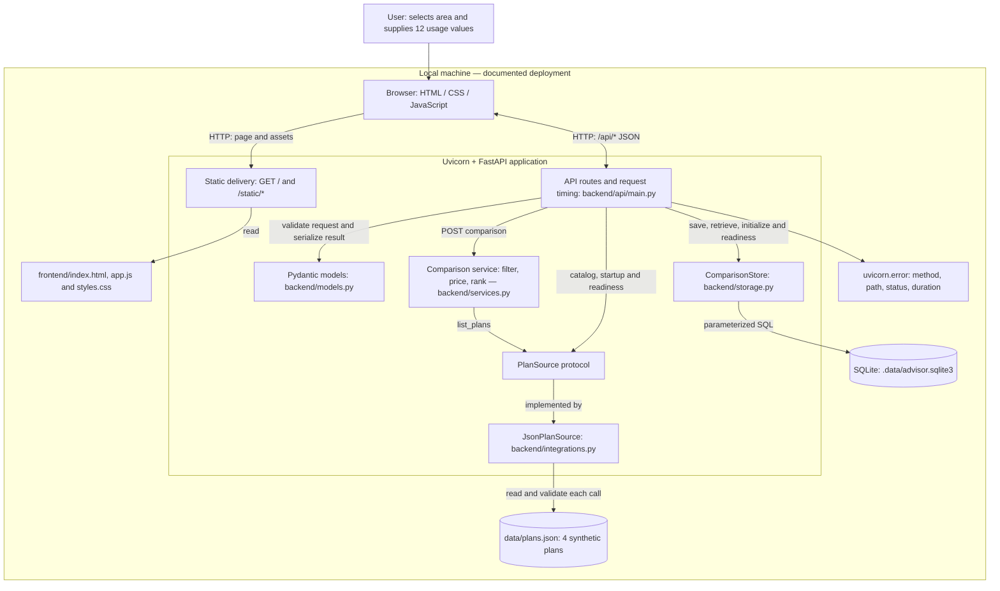
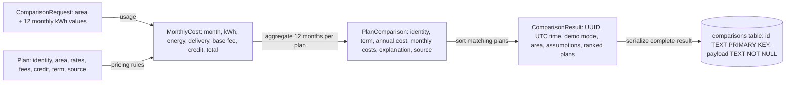

# Smart Power Plan Advisor: architecture and code review

Historical baseline: this review predates the optional document Q&A feature.
See [the RAG architecture](rag.md) for the OpenAI/Pinecone/LangGraph addition on
2026-09-11. The comparison-path findings below were not remediated by that addition.

Reviewed on 2026-09-10 against application code at commit `d78ebbe`, on `feature/jagdish`. Scope: all backend modules, browser assets, catalog, tests, dependency manifests, README, and the root [specification](../../spec.md). This is an implementation-based review, not a proposed cloud architecture.

## 1. Architectural assessment

The application is a **small modular monolith for a local demonstration**. One FastAPI application serves both the browser assets and JSON API. Python computes prices from a local synthetic catalog, and SQLite stores complete comparison results. There are no separate deployed services, background workers, external integrations, or AI components.

The design is appropriate for demonstrating monthly usage-based plan comparison. Its strongest choices are decimal pricing, calculation of each month independently, a replaceable plan-source boundary, and persistence of results before reporting success. Keep these properties as the application grows.

The most consequential current issues are failure handling and incomplete catalog validation. Saved links also inherit a catalog dependency in the browser that their API does not have. Production readiness is a separate question: this application explicitly has no customer identity, ownership controls, live-offer verification, or deployment infrastructure. Those are scope gaps rather than regressions in the local demo.

Recommendations in this document are **proposals, not implemented or approved requirements**. Before implementing any of them, follow [AGENTS.md](../../AGENTS.md) and update `spec.md` with the intended behavior and acceptance criteria.

## 2. Current architecture diagram

This diagram shows logical components within the documented local deployment. All backend boxes belong to the same Python application; arrows between them are function calls, not network requests.



The default database path is rooted at the application directory. `ADVISOR_DB_PATH` can override it, and an explicit `create_app(db_path=...)` takes precedence. A relative environment path follows the process working directory. The documented Uvicorn command binds to `127.0.0.1:8000`; the application itself does not enforce loopback binding.

### Responsibilities and boundaries

| Component | Responsibilities | Architectural observation |
| --- | --- | --- |
| Browser | Input parsing, catalog selection, API requests, results and saved-link presentation | No pricing is performed here. Decimal response strings are converted to JavaScript numbers for display only. |
| FastAPI factory/routes | Dependency assembly, startup, validation, HTTP status mapping, persistence orchestration | A compact composition root. The route coordinates the calculate-then-save use case. |
| Pydantic models | Request constraints, plan and result shapes, decimal serialization | Shared across transport, calculation and persistence. Schema changes also affect reading old snapshots. |
| Comparison service | Area filtering, monthly charges, ranking, assumptions and explanation templates | No direct HTTP or SQLite dependency. `calculate_month` is deterministic; `compare` also reads the source and generates a UUID/timestamp. |
| PlanSource / JsonPlanSource | Abstract catalog retrieval and concrete file parsing | The source is injectable. No ingestion pipeline, snapshot cache, retry policy, or source-version contract exists. |
| ComparisonStore | Table initialization and JSON snapshot insertion/retrieval | Concrete SQLite dependency constructed by the API factory. No storage protocol or store-instance injection yet. |
| Tests | Pricing assertions and HTTP/storage integration | Four test methods cover the primary path and selected invalid inputs. No browser or load tests are present. |

This is layered organization with one explicit interface, not a full ports-and-adapters architecture. Separating the application into microservices would add operational complexity without solving the observed problems.

## 3. Request lifecycles

### Create and save a comparison

```mermaid
sequenceDiagram
    actor User
    participant UI as Browser
    participant API as FastAPI
    participant Calc as compare / calculate_month
    participant Source as JsonPlanSource
    participant JSON as plans.json
    participant Store as ComparisonStore
    participant DB as SQLite
    User->>UI: Select area and enter 12 monthly kWh values
    UI->>UI: Validate tokens and disable submit
    UI->>API: POST /api/comparisons
    API->>API: Validate ComparisonRequest
    alt Invalid request
        API-->>UI: 422 validation detail
    else Valid request
        API->>Calc: compare(request, source)
        Calc->>Source: list_plans()
        Source->>JSON: Read and parse catalog
        JSON-->>Source: Plan records
        Source-->>Calc: Validated Plan objects
        Calc->>Calc: Exact area filter
        loop Each matching plan and each of 12 months
            Calc->>Calc: Decimal charges, rounding and credit
        end
        Calc->>Calc: Sum annual totals; sort by cost then ID
        Calc-->>API: Result with UUID, timestamp and explanations
        API->>Store: save(result)
        Store->>DB: INSERT id and serialized payload
        DB-->>Store: Commit succeeds
        Store-->>API: Saved
        API-->>UI: 201 ComparisonResult
        UI->>UI: Render; replace URL; enable submit
    end
```

Only the main valid-input path and request validation are shown above. No matching area returns 422. Other failure distinctions are documented below. A storage exception prevents the 201 response; there is no unsaved-preview fallback.

The creation API is not idempotent. Repeating an identical request generates a different UUID and row. If storage commits but the response is lost, retrying can create another snapshot. This is acceptable for the current demo but should be an explicit decision before adding automatic retries or account histories.

### Reload a saved comparison

```mermaid
sequenceDiagram
    participant UI as Browser at /?comparison=id
    participant API as FastAPI
    participant Catalog as PlanSource
    participant Store as ComparisonStore / SQLite
    UI->>API: GET /api/plans
    API->>Catalog: list_plans()
    alt Catalog request fails or returns no areas
        API-->>UI: Error or empty catalog
        UI->>UI: Display error; skip saved-result request
    else Catalog has areas
        API-->>UI: Catalog and sorted delivery areas
        UI->>API: GET /api/comparisons/id
        API->>Store: get(id)
        Store-->>API: Deserialize stored result
        API-->>UI: Saved result without recalculation
        UI->>UI: Render and restore area / usage
    end
```

The API retrieval path depends only on storage once the application is running. The browser imposes the extra catalog dependency. Additionally, startup always validates the catalog, so a broken catalog can prevent a new application process from serving even old results.

If a saved delivery area is removed from an otherwise valid catalog, setting the selector to that old area leaves no matching option. Usage restoration also assumes a nonempty recommendations list and reads usage from its first plan. Normal creation supplies that list, but historical schema changes must preserve or migrate this assumption.

## 4. Data architecture and pricing integrity



The diagram shows composition and calculation dependencies, not separate relational tables. Only `comparisons` is a database table. Usage is repeated in every plan's monthly costs; there is no separate customer, usage, or plan table.

### What is sound today

- Python Decimal and half-up rounding avoid binary floating-point pricing arithmetic. Energy, combined delivery, base fee, and credit are rounded separately before the monthly total is summed.
- Credit thresholds are inclusive and evaluated for each month. Alternating 500/1500 kWh correctly differs from using a 1000 kWh average: annual Oncor totals are $1920 for Simple and $2040 for Usage Credit.
- Ranking uses annual cost then plan ID, so ties have a defined order when IDs are unique.
- Snapshot retrieval preserves the original calculated result despite catalog changes. Parameterized SQL and `textContent` rendering avoid SQL interpolation and HTML interpretation in these paths.
- Exact area matching and explicit synthetic-data labels avoid pretending that an address or offer has been verified.

### Limits of the current contract

The service supports one fixed energy rate, one fixed delivery rate/fee, one base fee, and one optional threshold credit. The term defaults to 12 months but is not restricted to 12 by validation. Unknown plan fields are silently ignored; plan IDs are not checked for uniqueness; threshold/credit consistency is not enforced across fields. These are material ingestion risks if the JSON fixture becomes externally supplied data.

The stored result preserves calculated amounts, plan ID/name/term/source, and usage. It does **not** preserve the original rate/fee inputs, catalog version or content hash, pricing-engine version, or snapshot schema version. Therefore, it can redisplay a historical estimate but cannot fully establish which input rules produced it. “Immutable” here means the application exposes no update endpoint; it is not tamper-evident or protected from direct database edits.

## 5. Findings and recommended actions

Priorities are relative to intended deployment: **P1** is a gate before shared use or live data, **P2** is a focused reliability improvement, and **P3** is maintainability work. No critical defect was demonstrated for the shipped catalog on the tested happy path. Runtime probes used temporary catalogs and databases, not repository data.

### AR-01 — P2: saved links depend unnecessarily on catalog availability

**Evidence:** [`frontend/app.js`](../frontend/app.js), `initialize()` lines 76–95, fetches the catalog before inspecting/loading the saved ID. [`backend/api/main.py`](../backend/api/main.py), `get_comparison()` lines 67–72, does not read the source.

**Verified trigger:** corrupt the catalog after startup. Direct saved-result retrieval still returns 200. A Node VM check executing the actual frontend with a failed catalog response observed only `/api/plans`; no saved-result request was issued.

**Impact:** previously saved comparisons cannot be opened through the UI during a catalog outage. Removed delivery areas also do not restore correctly in the selector.

**Proposed acceptance:** a saved link renders its stored result when catalog loading fails or its area disappears. The form can separately explain catalog unavailability. Decide whether serving historical records should also survive a catalog failure at process startup.

### AR-02 — P2: server catalog errors are classified as user errors

**Evidence:** [`backend/api/main.py`](../backend/api/main.py), `create_comparison()` lines 58–65, catches any `ValueError` raised by `compare`, including catalog parsing and model validation failures from inside it.

**Verified trigger:** replace valid catalog contents with malformed JSON after startup. POST returns 422, catalog GET returns 500, and health returns 503. A catalog plan with a negative rate also produces POST 422.

**Impact:** a valid user request gets a client-error status for a server-side data problem; parser/validation text may reach the client, and users receive misleading input guidance.

**Proposed acceptance:** use a dedicated no-matching-plans/domain exception for 422 and a separate source-unavailable error with a stable server-error response. A malformed server catalog must not be presented as invalid user usage. Preserve detailed diagnostics in logs.

### AR-03 — P1 before live data: catalog validation does not enforce the pricing contract

**Evidence:** [`backend/models.py`](../backend/models.py), `Plan` lines 17–28; [`backend/integrations.py`](../backend/integrations.py), `list_plans`; [`backend/services.py`](../backend/services.py), `compare`.

**Verified triggers:** a 24-month plan is accepted and reported with `term_months=24` while only 12 months are calculated; an unknown `misspelled_fee` field is dropped; duplicated plan IDs produce duplicate recommendations.

**Impact:** catalog edits can silently misrepresent supported products. Current fixtures do not exercise these cases.

**Proposed acceptance:** for the current model, reject unsupported terms, unknown pricing fields and duplicate IDs, and define credit-field consistency rules. Introduce versioned rule types before expanding beyond fixed 12-month plans. Do not implement an arbitrary zero-floor or a new billing rule without specifying it.

### AR-04 — P2: readiness can be green when comparison is unusable

**Evidence:** [`backend/api/main.py`](../backend/api/main.py), `health()` lines 43–51; [`backend/storage.py`](../backend/storage.py), `healthy()` lines 28–31.

**Verified trigger:** an empty JSON array passes health with 200 while comparison creation returns 422. Source inspection also shows the database check only queries a table; it does not establish write availability.

**Impact:** the current readiness signal means “readable dependencies,” not “able to create comparisons.” Disk-full/write-permission failures were not fault-injected in this review.

**Proposed acceptance:** define the health contract in the spec. If readiness means comparison availability, reject empty/unusable catalogs and choose a deliberate method for evaluating write readiness. Keep process liveness distinct if deployment automation later needs it.

### AR-05 — P1 before shared use: comparison IDs have no ownership enforcement

**Evidence:** creation and retrieval routes have no identity dependency, and the schema has no owner field. The loopback deployment and lack of authentication are explicitly documented.

**Impact:** anyone with server access and a saved ID can read its usage and cost data. A UUID makes guessing harder but is not an ownership policy. Repeated creation is also unrestricted at the application layer.

**Proposed acceptance before shared deployment:** specify identity, ownership, intended sharing behavior, and resource limits; then test cross-user access and public-link behavior. This is a future deployment gate, not a request to add authentication to the current local demo.

### AR-06 — P2 before durable histories: snapshots are unversioned and only partially reproducible

**Evidence:** [`backend/storage.py`](../backend/storage.py), `save/get` lines 19–26, persists `ComparisonResult` and reads it with the current model. The result schema omits input rates and version metadata.

**Impact:** changing required result fields may break old saved links; historical output cannot be fully recalculated from its original rules. There is no migration, retention, backup, or restore workflow in the repository.

**Proposed acceptance:** version snapshot schemas, preserve the exact plan inputs and calculation version needed for replay, and retain compatibility tests with earlier fixtures. Define retention and recovery expectations before accumulating customer history.

### AR-07 — P3: operational confidence is narrower than the feature surface

**Evidence:** four existing test methods; no checked-in CI configuration or dependency lockfile found. Dependency ranges are broad. The request middleware logs after `call_next` without a `finally` path, so its custom timing line is not assured on an uncaught exception. Framework/server logs may still record the failure.

**Impact:** dependency resolution can change between environments, and several failure paths lack regression protection. In this review the installed Starlette emitted an HTTPX TestClient deprecation warning, although all tests passed.

**Proposed acceptance:** establish supported runtime versions and reproducible dependency resolution; add focused tests for AR-01–AR-04 and snapshot compatibility; run them in CI. Include correlation and failure-path timing if operational diagnosis becomes necessary. A metrics platform is unnecessary for this small local demo.

## 6. Performance, consistency and deployment tradeoffs

Let `C` be catalog size and `M` the count matching the chosen area. Each comparison reads and validates all `C` records, calculates `12 × M` monthly rows, sorts `M` plans, and serializes all monthly details. Approximate work is `O(C + 12M + M log M)` with result size `O(12M)`. This is negligible for four fixture plans; no throughput or latency benchmark was performed.

The source is reread on catalog requests, comparisons and readiness checks. There is no consistency token linking the catalog the user saw with the one used on submission. An edit between those requests may change eligibility or rates. For live sources, publish a validated versioned catalog snapshot atomically and associate comparisons with that version. Caching alone would not define correctness.

SQLite connections are opened and closed per store operation. Each save has its own transaction; there is no distributed transaction with catalog access. There is no configured WAL mode, custom contention handling or storage retry policy. Concurrent-write capacity and recovery have not been tested. Multiple server instances with separate local database files would not share saved links; a shared storage design would be needed for that topology.

The browser enables submission after catalog load, before a pending saved-result fetch finishes. In principle a slow historical response could overwrite a newly created result; this race was identified by inspection, not reproduced. An explicit loading state or stale-response guard is a suitable small fix if specified and tested. Requests also have no application-defined timeout/cancellation policy.

## 7. Verification evidence

Tests ran in an isolated environment at `/private/tmp/power-advisor-architecture-review`. The initial sandboxed dependency download failed on network resolution; a permitted retry installed the repository's declared development requirements. No application code, catalog data, or real comparison database was changed.

Test environment: Python 3.14.0, FastAPI 0.141.1, Pydantic 2.13.5, Starlette 1.6.0, Uvicorn 0.52.4, HTTPX 0.28.1. These are versions resolved for this review, not a repository lockfile or a recommended upgrade target.

| Check | Result / scope |
| --- | --- |
| `python -m unittest discover -s tests -v` from the application directory | All four existing test methods passed. |
| `node --check frontend/app.js` | Passed. Syntax validation only. |
| Temporary catalog corruption after startup | POST 422, catalog GET 500, health 503, existing saved GET 200. |
| Empty catalog | Health 200; creation 422. |
| Invalid negative plan rate | Creation 422. |
| 24-month plan | Accepted; result contains term 24 with 12 calculated months. |
| Unknown plan field / duplicate ID | Unknown field ignored; duplicate ID included twice. |
| Repeat identical POST | Produces a different comparison ID. |
| Snapshot inspection | Plan input rates absent from recommendations. |
| Node VM with actual `app.js`, a minimal DOM stub and failed catalog response | Saved-link initialization requests only the catalog, confirming the short-circuit. |

The temporary probes are exploratory evidence, not committed regression tests. Reproduce backend probes by injecting a `JsonPlanSource` pointing to a temporary copy of the catalog through `create_app`, opening `TestClient` with `raise_server_exceptions=False`, saving a comparison, and altering only the temporary file after startup. This distinguishes request-time failures from startup validation failures.

No full-browser visual/accessibility audit, load test, disk-failure experiment, dependency vulnerability audit, or production deployment was performed. Source-level accessibility features are present, but accessibility conformance is not claimed.

## 8. Recommended evolution

| Stage | Proposed work | Completion evidence |
| --- | --- | --- |
| Stabilize the local demo | Specify and resolve AR-01–AR-04; cover rounding edges, ties and CenterPoint expected bills; establish repeatable dependency/test setup. | Focused tests verify saved-link independence, error classification and supported catalog invariants. |
| Support durable shared comparisons, if required | Define account/sharing model, snapshot versions, provenance, storage recovery, retention and duplicate-request policy. | Ownership tests, historical-fixture reads, restore exercise and concurrency measurements. |
| Introduce verified live plans, if required | Add authorized source ingestion, explicit offer validity/area rules, reviewed pricing types and versioned catalog publication. | Independent expected-bill cases and traceable source versions for each recommendation. |
| Add AI features only for a specified user need | Consider extraction or explanations around verified inputs/outputs, with separate evaluation. Keep arithmetic and ranking deterministic. | Extraction validation or explanation evaluations appropriate to the chosen feature. |

Keep a single deployable application until measured scale or team boundaries justify separation. The existing `PlanSource` is a useful first seam; introduce a storage interface or application-use-case layer when multiple adapters or clients actually need them. React, PostgreSQL, queues and vector storage are options for future requirements, not prerequisites for this demo.

Before choosing a shared or live-data target architecture, clarify intended users, authorized data sources, supported billing rules, expected traffic, and history/sharing needs. These decisions are not needed to understand the current code, but they determine which proposals should become requirements.
