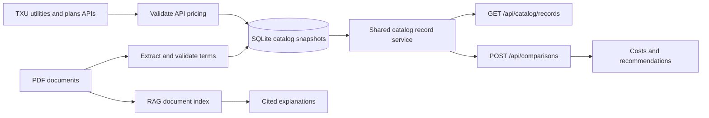

# Plan ingestion and comparison flow



Both ingestion sources produce the `catalog-v1` API contract. Comparisons read
those records through the same server-side service as the HTTP endpoint, using
only stored components, explicit units and monthly usage. They do not extract a
PDF or ask RAG/model output to supply a price. `data_source: "pdf"` and `"txu"`
filter the ingestion origin; both use this shared calculation flow.

SQLite's existing `revisions`/`sources` tables retain all extracted PDF fields,
source text and validation results. `txu_refreshes` retains complete provider API
snapshots. The common API is a projection of those stored records; there is no
second database to synchronize. Local sync commands remain the trusted write
boundary. A future provider adapter should implement this contract and validation
before making records eligible, rather than add another calculator.

Each record provides identity/revision, name/provider/area/term, recurring charge
components, price examples/checks, eligibility and exclusion reasons, provenance
and complete extracted/provider data in `source_details`. PDF quotes/pages remain
source evidence; API records use source URLs, hashes and fetch timestamps. A
missing source PDF prevents downloading that evidence but does not prevent
calculation from an already ingested record. The next PDF sync withdraws deleted
sources; failed source updates stop serving previous terms.

Browse `/api/catalog/records?source_type=pdf` or
`/api/catalog/records?source_type=txu&zip_code=78681`. Optional filters are
`utility_id` and `calculable`; pagination uses `limit` and `offset`.
`/api/catalog/records/{id}` returns a current record; the older `/api/catalog/plans`
and document endpoints remain PDF extraction audit interfaces. Comparison results
link to catalog records and retain their source revisions. Saved comparisons are
immutable snapshots even when the current catalog changes.

PDF ingestion still excludes incomplete/unsupported tariffs after validating
source evidence. TXU no longer requires an EFL: complete supported API billing
terms can qualify directly. Optional PDFs support document review/RAG. Averages
alone, or descriptions advertising a credit without modeled rules, cannot supply
an exact usage-based bill.

Use the existing [combined updater](update-data.md) to update SQLite and RAG from
PDFs, with optional TXU ZIPs. Or run the separate catalog commands:

```sh
python -m backend.catalog.cli --env-file .env sync
python -m backend.catalog.cli sync-txu --zip 79756 --zip 78681
```

These commands work from the inner application directory on macOS and Windows
with the virtual environment activated. No additional migration is required:
existing SQLite snapshots are immediately readable through the shared API.

The comparison form automatically includes both PDF and TXU catalog imports;
there is no source dropdown. New UI requests use `data_source: "catalog"`.
A utility selector appears only when needed. Missing or stale TXU data does not
block eligible PDF imports for a known delivery area. Individual-source API modes
and existing saved comparisons remain compatible.
