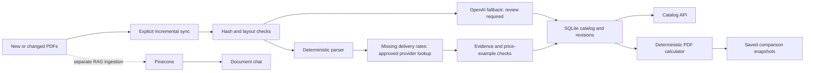

# PDF plan catalog and calculator

SQLite stores structured plans, document revisions and ingestion status. Pinecone
remains the separate document-search index used by chat. Catalog API reads and
calculations do not need a model call or a Pinecone connection.

## Run ingestion

From the application directory with optional RAG dependencies installed:

```sh
.\.venv\Scripts\python.exe -m backend.catalog.cli --env-file .env sync
.\.venv\Scripts\python.exe -m backend.catalog.cli status
```

Drop new PDFs anywhere beneath `data/`, then run `sync` again. File extensions
are case-insensitive. New/changed files are processed; unchanged successful files
are reused. `sync --retry` retries failed or review-required records; `sync --force`
reprocesses all. Neither operation deletes revision history. Missing files become
inactive. A missing/unreadable root aborts discovery instead of emptying the catalog.
Only one sync can run at a time. Interrupted runs can be safely restarted.

The default SQLite file is `.data/plans.sqlite3`, separate from saved comparisons.
Set `PLAN_CATALOG_DB_PATH` and `PLAN_DATA_DIR` consistently for the server and CLI
when using different paths. CLI `--db` and `--data-dir` override those settings.
Both the database and local keys are ignored by Git; another checkout must run sync.

Supported EFL layouts use deterministic extraction and require no API key. Unknown
layouts use the configured OpenAI model through the existing ignored `.env` key;
these records remain review-required and cannot enter the calculator. PDF text is
sent to OpenAI only for this fallback. No keys are written by sync.

**Catalog sync does not update Pinecone.** Chat still sees the active RAG manifest.
The existing `backend.knowledge.cli ingest` is a separate operation with its own
page policy. Both ingestion paths now skip structurally blank pages and preserve
original page numbers; scanned/nonblank pages without usable text remain rejected. A future combined publishing flow can link
both stores without making vector metadata the pricing database.

## Missing TDU charges

When a PDF omits delivery charges, sync discovers its provider's TDU/TDSP link.
Initially, automatic fetching supports the approved [4Change residential table](https://www.4changeenergy.com/tdu-charges)
for Oncor and CenterPoint. Other recognized provider links are recorded for review;
adding another provider requires a reviewed URL and table parser in `backend/catalog/tdu.py`.

The lookup fills only missing charges, preserving stated PDF rates. It stores the
source URL, table snapshot/hash, fetch time and publication date separately from
PDF evidence. A dated table must not be newer than the PDF issue date, and the
completed rates must still pass all advertised-price checks. Unsupported, unavailable,
ambiguous or conflicting data leaves the plan excluded with a lookup reason.

Normal sync reuses unchanged records. To refresh dependent plans explicitly:

```sh
python -m backend.catalog.cli --env-file .env sync --refresh-tdu
```

Run this inside the inner `smart-power-plan-advisor` application folder containing
`backend/` and `.env`. A failed refresh removes previously fetched rates from the
active calculation. Saved comparisons retain their original evidence. Comparison
results and the UI include the external source link and publication date. No API
read fetches provider websites, and catalog enrichment does not add web pages to chat.

## API

| Route | Result |
| --- | --- |
| `GET /api/catalog/plans` | Paginated unique plans, extracted facts and components, evidence, eligibility, issues, source files and revision references. |
| `GET /api/catalog/plans?provider=Reliant&service_area=Oncor&calculable=true&limit=20&offset=0` | Provider substring, exact area and eligibility filters. Limit 1–100, default 50. |
| `GET /api/catalog/plans/{id}` | One current extracted plan. |
| `GET /api/catalog/plans/{id}/document` | Original PDF after checking path and its corresponding source hash. Missing/changed sources return 404. |
| `GET /api/catalog/status` | Unique/calculable counts, per-file status and latest run summary. |

Numeric tariff fields are decimal strings. Facts and components contain original
page numbers and exact supporting excerpts. External delivery components instead carry
a web URL and table excerpt, with the full snapshot in `tdu_lookup.source`. Plan IDs derive from extracted content,
so changed terms produce a new content identity. Identical extraction payloads from
re-exported PDFs share one API plan with per-file hashes. Each source/revision is
retained separately in SQLite. Old comparison results retain their original values,
revision references and source URL; a source link may become unavailable after removal.

The original `GET /api/plans` remains the synthetic demo API for compatibility.
There is no public upload or sync POST endpoint: ingestion is an explicit local CLI
operation, which can later be invoked by a scheduler.

## Calculator

The UI defaults to **Extracted PDF plans** and allows explicit **Synthetic demo
plans**. PDF mode never fills missing rates with demo rates.

```json
{
  "zip_code": "75201",
  "data_source": "pdf",
  "monthly_kwh": [800, 750, 700, 850, 1100, 1400, 1600, 1500, 1200, 950, 750, 850]
}
```

Send this body to `POST /api/comparisons`. Omitting `data_source` preserves legacy
demo behavior. Saved results include `data_mode`, source URLs/revisions and an
`excluded_plans` list with reasons. The UI renders source links and exclusions.

The existing limited lookup maps 75201/75001 to Oncor and 77002/77007 to CenterPoint.
It does not verify address eligibility. The current PDF collection contains Oncor
plans; a CenterPoint ZIP therefore has no eligible PDF result. Unsupported ZIPs or
no calculable plans return an actionable 422. Ingesting a supported CenterPoint EFL
can add coverage after layout/parser review; there is no external ZIP service.

## What is safe to calculate in this version?

A plan needs a recognized structural layout, valid exact source evidence, a fixed
product, stated service area, a contract of at least 12 months, complete flat energy
and delivery charges, and supported monthly-usage conditions. The calculator uses
Decimal arithmetic, preserves strict/inclusive credit boundaries, and applies
conditional usage charges independently for each month.

Calculated average prices must match the stated 500/1000/2000-kWh examples within
0.15 cents/kWh. This is a consistency check, not independent tariff approval. A
zero base charge may come from an explicit zero or a recognized exhaustive list of
recurring charges; the derivation is recorded alongside its source excerpt.

Tiered rates, free-night/day plans requiring interval usage, seasonal credits,
variable rates, missing delivery charges and shorter contracts remain browsable but
excluded. Published average prices are never used to reverse-engineer missing rates.
The output estimates the first 12 months with document-date rates held constant;
it excludes taxes and nonrecurring fees and does not verify current offer availability.

For future files, `layouts.json` is a checked-in reviewed allowlist. Whitespace and
numbers are normalized for layout matching, but labels, prose and operators are
preserved. A numeric change can pass the same parser; new fee language cannot.
Update the spec, parser, layout allowlist and independent expected-bill tests before
supporting a new pricing structure. Increment `VERSION` when extraction semantics
change; sync then reprocesses successful records for that version. Failed files can
be retried with `--retry`.

## Architecture



## Verification

The current ingestion processes all 22 source files, exposes 20 unique plans and
allows nine unique plans into the calculator after the 4Change TDU lookup. A repeated sync reused all 22 files
with zero extraction calls. See `catalog-evaluation.json` for the earlier baseline and
`tdu-evaluation.json` for the live TDU/API verification. After integrating the latest main branch, all 53 Python tests and
11 JavaScript tests pass. Unit/API tests cover incremental changes, duplicates, deletion, missing roots,
source hash checks, blank versus scanned pages, price/credit boundaries, unknown
pricing language, PDF result snapshots and regression behavior. UI tests cover
explicit PDF mode and stale results after changing modes.

Storage rationale: [SQLite appropriate uses](https://www.sqlite.org/whentouse.html)
and [Pinecone data modeling](https://docs.pinecone.io/guides/index-data/data-modeling).


### Windows runtime and retry

Use the project virtual environment: system Python may lack the optional PDF
packages. If status shows `ModuleNotFoundError` for every source, install
`requirements-rag.txt` into `.venv` and retry using that interpreter:

```powershell
.\.venv\Scripts\python.exe -m pip install -r requirements-rag.txt
.\.venv\Scripts\python.exe -m backend.catalog.cli --env-file .env sync --retry
```

Previously failed files require `--retry`. Sync locking uses a nonblocking Windows
byte lock or POSIX flock, released on success and failure. Restart the server after
backend updates, or use `--reload --reload-dir backend` during local development,
so the API and browser agree on fields such as `data_source`.
