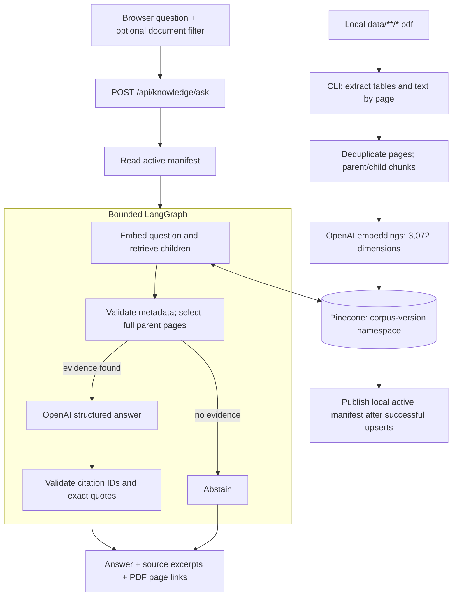

# Plan-document RAG

This optional feature answers questions about locally supplied electricity facts labels (EFLs), with PDF page citations. It uses OpenAI embeddings, a dedicated Pinecone dense-vector index, and LangGraph orchestration. It does not extract approved billing rules into the calculator. The calculator continues using its synthetic JSON plans.

## Models and chunking

| Choice | Configuration and reason |
| --- | --- |
| Embeddings | OpenAI `text-embedding-3-large`, explicitly 3,072 dimensions. A quality-oriented starting point for the small plan corpus; document and question embeddings use identical settings. |
| Vector index | Pinecone dense vectors with cosine similarity. Index dimension and metric are checked before ingestion/query. |
| Generation | OpenAI `gpt-4.1-mini` through Responses structured output, configurable with `OPENAI_RAG_MODEL`. A practical default for short grounded answers, not a claim of best performance across models. |
| Parent chunks | Complete PDF pages, capped at 1,800 tokens. Ruled tables are serialized by row and cell before chunking; pricing tables, footnotes, and adjacent conditions remain together in the LLM context. Oversized pages require review rather than silent splitting. |
| Child chunks | Up to approximately 450 tokens, with 60-token overlap and a preference for line boundaries. Children never cross pages or documents. They locate relevant parent pages; they are not the only text sent to the LLM. |
| Duplicate handling | Exact extracted-text duplicate pages within a PDF are indexed once, with the first original page number retained. |
| Retrieval | Query at most eight child vectors in the active versioned namespace, optionally filtered by document ID. Discard scores below 0.25 and mismatched metadata; deduplicate to at most four full parent pages. This score is a heuristic, not a calibrated confidence probability. |

This is **table-aware page-parent/child retrieval**, using pdfplumber's ruled-table detection rather than LLM semantic segmentation. Outer tables are serialized once, retaining cell boundaries and text outside tables; unruled pages fall back to ordinary text extraction. Complex layouts still require review. The EFL is a small, table-heavy document; preserving a full page is more useful here than sending arbitrary isolated fragments of a price row. The initial PDF has two identical extracted pages; preview yields one unique parent and two children. For longer or scanned documents, review extraction and adjust the versioned policy before expanding support. OCR is not included.

There is no universally best chunk size. Tune these defaults using the [evaluation questions](rag-evaluation.json), retrieval coverage, citation correctness, answer faithfulness, latency and cost. Changing the embedding model, dimensions or chunking policy requires reingestion into a compatible index/namespace.

## Architecture



There is no agent loop, tool execution, background indexing, chat history, automatic web fetching, or change to deterministic pricing. Retrieval and generation send source text/questions to OpenAI; ingestion stores child and parent text plus embeddings in Pinecone. The application requests `store=False` for Responses; this does not define the providers' overall data-retention policies.

Stable document IDs are derived from relative file paths. Document bytes, embedding settings and chunk policy contribute to a corpus version. Each corpus uses its own namespace beneath `PINECONE_NAMESPACE`; changing a source file produces a new namespace. Reingesting an unchanged corpus upserts the same vector IDs. Previous namespaces remain available for manual cleanup; this implementation never automatically deletes them.

The local `.data/knowledge.json` manifest is replaced atomically only after all upserts succeed. Failed ingestion cannot replace the active manifest, although a partial new namespace may remain remotely. Pinecone indexing is eventually consistent, so immediate searches after successful upserts may still need a short wait. A manifest is not a transactional commit across local storage and Pinecone.

## Setup

Run commands from the inner application directory, `smart-power-plan-advisor/`, using your chosen virtual environment's Python.

```sh
python -m pip install -r requirements-rag-dev.txt
```

Use `requirements-rag.txt` for runtime-only installation. The base `requirements.txt` still supports the original calculator without the optional RAG packages. The Pinecone SDK is constrained to the tested 8.x vector API; it is not the latest SDK major version. Upgrading to a later major should include adapter and integration tests.

An ignored `.env` was prepared with empty key fields. Populate it locally using `.env.example` as the reference. Do not paste keys into chat, place them in browser code, or commit them. Existing shell environment variables take precedence over the env file.

| Variable | Meaning / default |
| --- | --- |
| `OPENAI_API_KEY` | User-provided OpenAI API key. |
| `PINECONE_API_KEY` | User-provided Pinecone API key. |
| `PINECONE_INDEX` | Dedicated index name; `power-plan-documents`. |
| `PINECONE_NAMESPACE` | Namespace prefix; `power-plans`, followed automatically by a corpus hash. |
| `PINECONE_CLOUD`, `PINECONE_REGION` | New serverless index placement; `aws`, `us-east-1`. Choose a supported location for your Pinecone account before creation if needed. |
| `OPENAI_RAG_MODEL` | Generation model; `gpt-4.1-mini`. |
| `RAG_MANIFEST_PATH` | Optional override for `.data/knowledge.json`; use an absolute path for predictable launch behavior. |

Preview performs no OpenAI/Pinecone calls and does not write a manifest. Tiktoken may download its public tokenizer vocabulary on first use; subsequent previews use its cache.

```sh
python -m backend.knowledge.cli preview
python -m backend.knowledge.cli --env-file .env create-index
python -m backend.knowledge.cli --env-file .env ingest
python -m uvicorn backend.api.main:app --env-file .env --reload --host 127.0.0.1 --port 8000
```

Index creation is explicit, retains an existing compatible index, and enables deletion protection for a new one. Ingestion sends the extracted documents to the configured providers. Neither happens at application startup. After ingestion, refresh the browser to enable document Q&A.

## API and grounding behavior

| Endpoint | Contract |
| --- | --- |
| `GET /api/knowledge/status` | Local configured/indexed flags, model settings and indexed document summaries. Does not validate key access or live provider readiness. |
| `POST /api/knowledge/ask` | `{"question":"What is the contract term?","document_id":null}`; returns answer, abstention flag and citations. |
| `GET /api/knowledge/documents/{document_id}` | Serves an indexed PDF inline. Citation links add `#page=N`. The local file must still match its indexed hash and remain beneath `data/`. |

Questions are trimmed and limited to 2,000 characters. Unknown document IDs return 404, invalid input 422, missing configuration/indexing/dependencies 503, and provider failures a sanitized 502. Cleanup failures do not override the response. With no retrieved evidence the graph skips generation and abstains.

Generation must use known source IDs and supporting quotes. Validation rejects absent citations, unknown IDs, and quotes not found in the selected page after whitespace normalization. Factual explanations accompanying abstention follow the same rules; if no evidence is supplied, a fixed abstention message replaces generated prose. A model refusal or unusable parsed response also abstains. This verifies citation membership and excerpt presence; it does **not** mathematically prove that every answer claim follows from the quote. Human review and live evaluations remain necessary.

The sample EFL's credit condition is **greater than 999 kWh**. It does not supply numeric TDU charges and should not be used to invent a bill total. Rates, fees, and availability from these documents have not been approved for the calculator.

The feature retains the application's local, unauthenticated scope. Do not expose source-document routes or provider-backed requests to untrusted users without first specifying authentication, sharing permissions and usage limits.

## Verification

```sh
python -m unittest discover -s tests -v
node --check frontend/app.js
```

The dedicated `power-plan-documents` index was created using the user-provided keys, and the EFL was embedded and ingested successfully. The active extraction policy is `table-page-parent-1800-child-450-overlap-60-v2`; the previous namespace was retained. Live PDF source retrieval returned 200 with `application/pdf`.

The first live pass exposed interleaved question/answer columns in plain PDF text. Table-aware extraction corrected that issue, and the termination-fee question then returned an exact supporting excerpt. This is why extraction quality is part of the chunking design.

Final automated validation: **20 Python tests passed** (four calculator tests plus 16 RAG tests), as did JavaScript syntax validation. A Node DOM-stub check exercised form initialization, plain-text rendering, PDF links and error recovery. No connected browser was available for visual QA. The app was started with the repository's virtual environment on `http://127.0.0.1:8011`; its page, health and RAG status endpoints returned 200.

| Live case | Observed outcome |
| --- | --- |
| Credit condition | $125 per billing cycle at usage greater than 999 kWh; exact page-1 excerpt. |
| Contract term | 12 months, with the table row cited. |
| Termination fee | $20 multiplied by remaining contract months, with the full table-cell answer cited. |
| Missing TDU rates | Abstained from giving numeric rates and supplied a supporting pass-through excerpt. |
| Requested real-plan bill total | Abstained; final run used the conservative citation-validation fallback rather than inventing a total. |
| Instruction injection / invented free electricity | Rejected the invented claim with a valid pricing excerpt. The final run labeled this corrective answer `abstained=false`, despite the fixture expecting true. |

Five of six exact expected-abstention flags matched in the final evaluation. The injection case was a labeling mismatch, not an observed execution of the injected instruction. Treat this as a model-behavior limitation; no broader attack resistance or benchmark success is claimed. The local ignored `.data/knowledge-evaluation.json` records the live answers. Initial and corrected extraction runs used versioned namespaces; no existing namespace was deleted.

Use `rag-evaluation.json` for the live check once configured. For each question, record whether the correct page was retrieved, whether abstention matched expectation, and whether every material claim is supported by its excerpt. Include the numeric inequality, missing TDU rates, termination formula and an instruction-injection question. Do not declare chunking or model quality validated based only on mocked tests.

Official API references: [OpenAI embeddings](https://developers.openai.com/api/docs/guides/embeddings), [GPT-4.1 mini](https://developers.openai.com/api/docs/models/gpt-4.1-mini), [structured outputs](https://developers.openai.com/api/docs/guides/structured-outputs), [Pinecone Python SDK](https://docs.pinecone.io/reference/sdks/python/overview), and [LangGraph Graph API](https://docs.langchain.com/oss/python/langgraph/graph-api).
