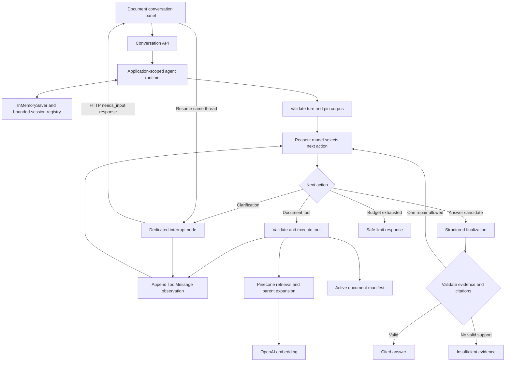

# Document ReAct agent: architecture review and implementation plan

Status: **original proposal; first increment now implemented with adjustments in root spec section 11.1**. Reviewed 2026-09-11 against branch `feature/jagdish`, baseline commit `8ae554f`. This document preserves the original broader proposal. See [the agent guide](agent.md) for delivered behavior and verification.

## 1. Decisions and intended outcome

The user confirmed **document questions only** and **in-memory conversations**. Build an explicit LangGraph ReAct loop that can discover indexed documents, retrieve evidence, refine a search, ask a clarifying question, and produce a page-cited answer. Follow-up questions retain context within the running application process. Restarting the server clears conversations and pending clarifications.

Keep the deterministic comparison feature and existing single-question RAG endpoint available. Do not expose calculator, enrollment, filesystem, web browsing, ingestion, or index-administration tools to this agent. Questions about documented contract conditions are supported; calculating a real bill, recommending the cheapest offer, and validating current offer availability remain outside this version.

Use the existing OpenAI and Pinecone configuration. Retain `text-embedding-3-large` at 3,072 dimensions, cosine similarity, and the current page-parent / 450-token child / 60-token overlap extraction policy. Agent orchestration alone does not require re-embedding. Start with configurable `gpt-4.1-mini`, the existing generation default; evaluate its tool selection and citation quality before considering a model change.

## 2. Whole-application review

| Area reviewed | Current behavior | Implication for the agent |
| --- | --- | --- |
| Root `spec.md`, `AGENTS.md` | Implemented requirements and mandatory spec-first workflow | Add planned AGENT requirements before implementation; preserve current RAG guarantees. |
| `backend/models.py`, `services.py` | Strict 12-month comparison input; Decimal arithmetic, monthly credits and deterministic ranking | No agent changes needed. These calculations must not be reproduced in generated document answers. |
| `backend/integrations.py`, `data/plans.json` | Four synthetic plans loaded through `PlanSource` | These are not the PDF corpus. Do not offer them through document tools. |
| `backend/storage.py` | SQLite stores comparison snapshots | No chat state belongs in this database for the requested in-memory version. |
| `backend/api/main.py` | FastAPI factory/lifespan, comparison routes, static frontend, request logging | Assemble one optional agent runtime per application lifespan. Existing routes must work when AI configuration is absent. |
| `backend/knowledge/config.py`, `providers.py` | Optional provider settings, fixed embedding contract, Pinecone retrieval and OpenAI structured generation | Reuse retrieval and provider limits. Add a tool-calling model adapter without duplicating index administration. Keep clients and secrets out of graph state. |
| `backend/knowledge/documents.py`, `ingest.py`, `cli.py` | Table-aware extraction, full-page expansion, versioned namespaces, atomic manifest publication, hash-checked source serving | Preserve these boundaries. Agent tools may read only the active manifest and its evidence. Ingestion stays an explicit CLI operation. |
| `backend/knowledge/graph.py` | Fixed retrieve → context → generate → validate DAG; compiled per request; no message history | This is RAG orchestration, not ReAct. Extract reusable evidence selection and citation validation from graph closures before building the new loop. |
| `backend/knowledge/api.py`, `models.py` | One-question API, local configuration status, safe errors and cited PDF response | Keep its contract. Add separate conversation endpoints and response models for interrupted and completed runs. |
| `frontend/index.html`, `app.js`, `styles.css` | Plain JavaScript, independent comparison and document-question forms, safe text rendering | Add a document conversation panel with clarification and reset states. Reuse citation presentation; avoid rendering raw model HTML. |
| Dependency files, README and docs | Optional RAG dependencies and CLI setup; earlier architecture findings | Add optional agent dependencies and a single-process lifecycle guide. Avoid making calculator-only installations depend on the agent. |
| `tests/test_advisor.py`, `test_knowledge.py`, `docs/rag-evaluation.json` | 20 automated tests and six documented live evaluation cases | Reuse regression coverage; add graph, conversation, interruption and multi-search evaluations. |

### Findings that materially affect the design

1. **On-disk files are not the active knowledge base.** There are 22 PDFs containing 41 pages. The local active manifest lists only the original 4Change document. This is a local manifest observation, not a fresh remote Pinecone audit. Agent discovery and the UI must use that manifest, not a directory listing.
2. **A full-corpus refresh currently fails extraction policy.** Page 2 of `choosetexaspower/EFL-5.pdf` and `EFL-9.pdf` each yields zero extracted tokens. The other extracted pages fit the existing size ceiling; maximum observed size was 724 tokens. Zero text does not establish whether a page is blank or scanned. Visually review these pages before changing policy; do not silently skip them. The new agent can initially ship against the existing active corpus.
3. **Two incoming metadata files are invalid JSON.** `Reliant/Reliant_efls.json` is 18 bytes and `choosetexaspower/choosetexaspower_efl.json` is one byte. Neither is consumed by the current calculator or RAG pipeline. They must not become authoritative agent metadata without validation and a specified schema.
4. **Citation validation is structural.** The current graph checks that source IDs and quoted excerpts exist in retrieved context. It does not establish that every claim follows from those excerpts. Preserve the validator, add claim-linked answer structure and adversarial evaluations, and avoid describing this as a factuality guarantee.
5. **Evidence IDs currently restart at S1 for each request.** Multiple searches and follow-ups require evidence identity based on corpus, document hash and page. Otherwise an earlier citation can accidentally point to a later search result.
6. **Conversation introduces new lifecycle responsibilities.** The current API is stateless. In-memory checkpoints need bounded retention, same-thread serialization, duplicate-request handling and explicit restart behavior. An in-memory saver is not shared across application workers.
7. **Known RAG quality limitations remain relevant.** Prior live evaluation passed five of six exact expected abstention-flag checks; the injection example safely rejected a fabricated claim but used an unexpected flag. The new response status must follow validated output conditions rather than simply trusting a model boolean.

Historical issues such as comparison snapshot ownership, catalog validation and deployment hardening remain in `architecture-review.md`. They do not justify expanding this document-only agent into a calculator or platform rewrite.

## 3. Applying the reference notebook

The supplied [ReAct notebook](https://github.com/The-Gen-Academy/Mastering-Agentic-AI-Week3-Session1/blob/main/langgraph/1_Langgraph_React_Agent.ipynb) demonstrates a time-off assistant: message state with `add_messages`, a tool-bound model, explicit reason/action nodes, conditional routing, and `ToolMessage` observations. It later adds human clarification through `interrupt`, `Command(resume=...)`, and `InMemorySaver`. Its source was reviewed without executing the notebook.

Apply those fundamentals using `StateGraph`, not a prebuilt agent factory. Replace its time-off tools with document tools, its console input with HTTP clarification/resume, and its user-ID thread shortcut with isolated opaque conversation IDs. Do not copy its stub business operations or assume a notebook execution loop provides application lifecycle management. The official [LangGraph quickstart](https://docs.langchain.com/oss/python/langgraph/quickstart) also demonstrates explicit model/tool nodes and conditional tool-call routing.

Use `ChatOpenAI` from `langchain-openai` for message/tool integration, with tools bound once when constructing the runtime. Validate the adapter against installed dependencies during implementation; the current direct OpenAI client can remain for the existing RAG endpoint. See the official [ChatOpenAI integration](https://docs.langchain.com/oss/python/integrations/chat/openai).

## 4. Proposed architecture

The diagram exposes execution decisions and tool observations. The UI should show short operational activity summaries, not hidden chain-of-thought or internal prompts.

### Tools

| Tool | Input and result | Enforced boundary |
| --- | --- | --- |
| `list_indexed_documents` | No arguments; returns manifest document IDs, filenames and available pages | Lists indexed sources only; filename metadata is not proof of contract facts. |
| `search_document_evidence` | Nonempty query up to 2,000 characters; optional manifest document ID; returns selected page evidence with stable IDs | Apply existing corpus/hash/document/page checks, retrieve at most eight children, expand at most four parents, preserve source filters. Returns evidence, not a second LLM-generated answer. |
| `ask_user` | One concise question and optional choices tied to indexed document IDs | Routed to a dedicated interrupt node; cannot execute unrelated actions while waiting for clarification. |

Start with these three tools. A fetch-page tool, reranker, web search and additional specialist agents are unnecessary until evaluation demonstrates a specific gap. For multiple-document questions, the model can perform separate filtered searches within the same limits; absence of search results must not be presented as proof that a term does not exist anywhere in a document.

### State and runtime

`AgentState` should contain message history using `add_messages`, thread/turn identifiers, selected document scope, pinned corpus version, evidence registry, pending clarification, counters, and validated final output. Provider clients, API keys and session access tokens remain runtime dependencies outside serialized state.

Use an application-scoped compiled graph and `InMemorySaver`; never create a new saver for each request. Create random thread IDs and use an opaque browser session capability to bind access to its conversations. This is local session isolation, not customer authentication. Serialize execution per thread. Cache completed results by client request ID so a browser retry does not start another paid run.

Initial limits: 30-minute inactivity expiry, at most 100 active threads, and 20 user turns per thread. At capacity, expire idle sessions and otherwise return a capacity error; never evict an active run. Clear/reset removes checkpoints and session metadata. Restart or development reload loses all history; run one application worker. The frontend must explain an expired/missing conversation and offer a new one.

Bound the model context separately from checkpoint history: initially 12,000 input tokens with reserved output space, preserving complete assistant-tool message groups. Trim old completed turns and exclude obsolete evidence; ask the user to restate essential context if needed. A retained chat transcript alone is not evidence for a new factual answer.

### Execution, grounding and failure behavior

- Validate tool names and arguments with explicit schemas; match every observation to its tool-call ID. Disable parallel tool calls and reject unexpected multi-call batches with a controlled observation so the model can retry within budget.
- Initial per-turn budgets: six model calls including finalization/repair, eight tool calls, three searches, one citation repair, graph recursion limit 30, and 120 seconds of active execution. Clarification waiting is excluded from elapsed execution time, but resume must retain consumed counters. Reserve a finalization call; when none remains, return a deterministic limit response.
- Provider timeouts/retries remain bounded within the overall deadline. Cancellation must not leave a background run accepting a second message on the same thread.
- Treat user requests as requests and retrieved document text as untrusted evidence. Document instructions cannot change tools, scope or prompts.
- Use source-linked answer claims, with supporting excerpts and PDF page links. Require every substantive document claim to reference evidence from the current turn. General greetings and clarification need no citation. Preserve exact units, qualifiers and inequalities such as the EFL's **greater than 999 kWh** condition.
- Validate corpus, document hash, page, excerpt membership and citation identity before returning an answer. A repair gets one attempt; otherwise return a fixed insufficient-evidence message. Semantic correctness still requires evaluation.
- Return explicit statuses: `answered`, `needs_input`, `insufficient_evidence`, or `limit_reached`; infrastructure errors use safe API errors. Do not equate a model's abstention flag with verified safety.
- Pin the active corpus for a turn. If it changes while a clarification is pending, invalidate that turn and ask for resubmission against the new corpus. On later turns, resolve the active corpus again and re-retrieve facts; do not silently reuse stale evidence.
- Implement clarification in a dedicated node. LangGraph resumes by re-executing the interrupted node, so avoid unrelated operations before the interrupt and do not swallow its control-flow exception. Resume uses `Command` and the same thread; reject stale or repeated resume IDs. These semantics are documented in [LangGraph interrupts](https://docs.langchain.com/oss/python/langgraph/interrupts).

## 5. Proposed API and UI contracts

These are new version-one contracts; `/api/knowledge/ask` retains its existing response shape.

| Endpoint | Behavior |
| --- | --- |
| `GET /api/agent/status` | Safe local configuration summary, indexed document summaries, and in-memory lifecycle notice. No provider health claim or secret values. |
| `POST /api/agent/threads` | Create an isolated in-memory conversation; return thread ID and expiry information. |
| `POST /api/agent/threads/{id}/messages` | Accept request ID, message and optional document scope; return a validated answer, interruption or bounded-stop result. |
| `POST /api/agent/threads/{id}/resume` | Accept request ID, pending interruption ID and clarification text; continue the same logical turn. |
| `DELETE /api/agent/threads/{id}` | Explicit clear conversation; reject clearing during an active run or coordinate cancellation before deletion. |

Responses include `thread_id`, `turn_id`, `status`, and either answer/citations, clarification, or a safe stop reason. Include only sanitized tool activity summaries. Unknown/expired/inaccessible threads return 404; invalid input 422; active-thread or stale-resume conflicts 409; unavailable configuration 503; provider failure 502; capacity exhaustion 429. Never return prompts, raw provider errors or checkpoint internals.

Use ordinary request/response initially; SSE is optional later. The browser renders user/assistant turns, source excerpts and PDF links, shows pending clarification, disables overlapping submits, and provides a clear conversation control. Persist the browser's session capability in session storage, not URLs. Refresh may retain the thread handle in that tab; full history restoration on refresh is outside this version unless a read endpoint is explicitly added to the spec.

## 6. Implementation sequence and acceptance gates

| Phase | Files / work | Exit criteria |
| --- | --- | --- |
| 1. Finalize contracts and dependency spike | Root `spec.md`; optional `requirements-agent.txt` and agent development dependencies | AGENT requirements agreed; explicit graph/tool calling, structured output and in-memory interrupt/resume proven with a tiny scripted harness; compatible versions recorded. No provider/index changes required. |
| 2. Extract shared grounding functions | `backend/knowledge/graph.py`; proposed `backend/knowledge/evidence.py`; existing RAG tests | Parent selection and citation validation reusable without changing the single-question endpoint. All existing tests pass, with new multi-search evidence-ID coverage. |
| 3. Implement core ReAct loop | New `backend/agent/{models,state,tools,graph,model}.py` | Scripted model demonstrates discover → search → observe → refined search → final answer; malformed tools, unsupported questions, bad citations and budget exhaustion terminate safely. |
| 4. Add conversation runtime and API | New `backend/agent/{runtime,api}.py`; app lifespan integration | Follow-ups and interrupt/resume work in one process; isolated sessions, expiry, request deduplication and concurrent-message rejection tested. Restart intentionally loses threads. |
| 5. Add document chat | Existing frontend files; README and agent guide | End-to-end document selection, follow-up, clarification, citations, errors, reset and expired-session behavior work; calculator and old Q&A remain usable. |
| 6. Evaluate and complete specification | New `tests/test_agent.py`, `tests/test_agent_api.py`, document-agent eval cases; spec status/verification | Offline suite and browser checks pass; live evaluation reports factual support, retrieval coverage, tool trace, latency and cost separately. Mark implemented only after evidence is recorded. |

Implementation should expose model and retrieval interfaces for offline scripted tests. A small teaching notebook may demonstrate the production graph, state, tool observations and interruption; it must import production components rather than duplicate orchestration or business logic.

### Required acceptance scenarios

1. Answer the indexed 4Change term, credit threshold and termination-fee questions with correct page citations.
2. Follow “What is its contract term?” with “And its early termination fee?” while preserving document scope and revalidating supporting evidence.
3. Ask “What is the fee?” when multiple indexed sources or fee types make the question ambiguous; pause, accept clarification, and continue the same turn.
4. A scripted first search lacks support; the agent refines the query and uses the second observation. Assert the action loop, not merely answer text.
5. Missing TDU charges, real bill totals and cheapest-plan requests produce a clear supported limitation, without invented prices or calculator access.
6. Forged tool calls, document prompt injection, invented quotes, wrong document hashes and cross-search citation collisions never yield an unvalidated factual answer.
7. An exhausted budget, provider timeout, invalid tool argument and malformed model response terminate with bounded behavior and no secret exposure.
8. Duplicate message/resume requests do not repeat a completed run; simultaneous requests cannot corrupt a thread; one session cannot operate another session's thread.
9. Clarification resumes while the process lives, but restart/expiry requires a new conversation; corpus changes invalidate pending stale work.
10. Existing 20 tests remain green, comparison pricing remains exact, and calculator-only startup remains supported without optional AI dependencies or keys.

For live evaluation, distinguish answer correctness from citation validity and response status. Include unsupported and adversarial questions as release gates; report every critical failure rather than hiding it in an aggregate score. Corpus expansion is a separate work item: visually review zero-text pages, specify any ingestion-policy change first, preview the selected corpus, inspect table extraction quality and only then publish a new namespace. No reingestion occurred during this planning review.

## 7. Verification performed for this plan

Reviewed application source, frontend, schemas, dependency/configuration files, tests, existing architecture/RAG documentation, data inventory and the reference notebook. Ran all 20 Python tests successfully using the outer repository virtual environment; JavaScript syntax check passed. An initial test attempt used the inner environment, which lacks FastAPI; it was corrected to the existing configured environment without installing packages.

Inspected extraction output for all 41 PDF pages and the local active manifest. This was a text-extraction audit, not visual PDF QA or a new live provider evaluation. No application code, API keys, Pinecone data or dependencies were changed. Only this plan and its proposed requirements in the root specification are added.
